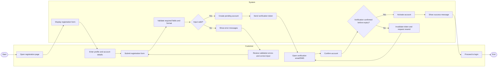
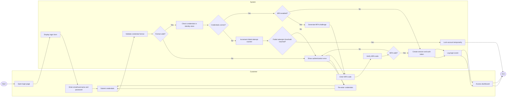
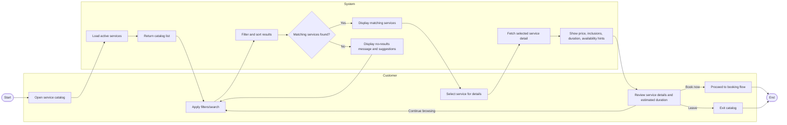
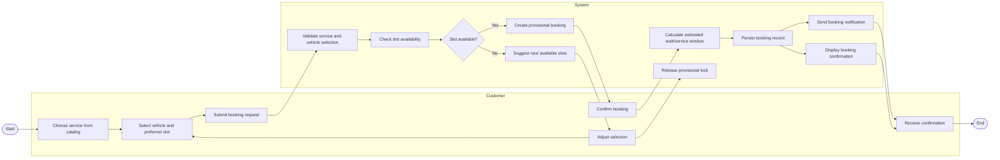
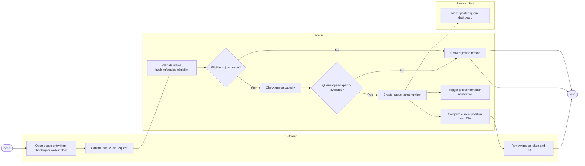
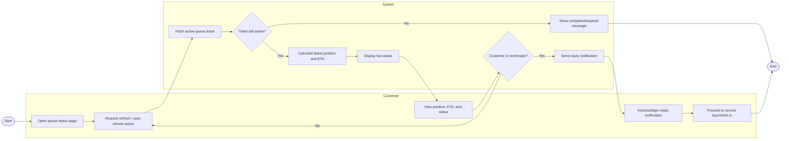
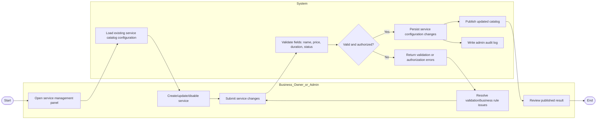
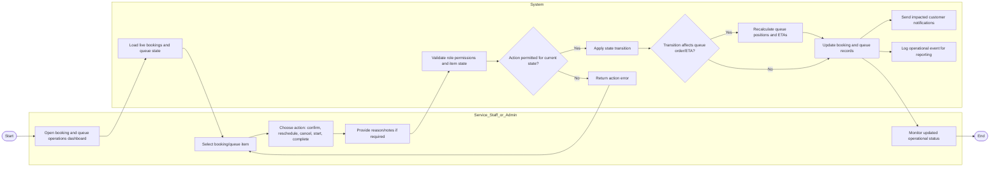

# Activity Workflow Modeling

## 1. Overview

Activity diagrams model how work moves through the system from start to finish, including who performs each action, where decisions happen, and where tasks can run in parallel. In this project, each diagram uses GitHub-friendly Mermaid flowcharts with role-based swimlanes (via `subgraph`) to represent responsibilities across customers, the platform, and operational actors.

## 2. Register Account Activity Diagram

### Explanation

- Key flow: the customer submits registration data, the system validates it, creates a pending account, and activates it after verification.
- Major decisions: input validation and token confirmation-before-expiry control whether the process loops or succeeds.
- Parallel concern: account creation and verification token dispatch are system-side sequential actions that enable asynchronous customer completion.
- Stakeholder concerns: customer usability (clear error feedback) and business security (verified accounts only).
- Traceability: aligns with **FR-01 User Registration and Authentication** and the product use cases **Register Account** use case; supports the product backlog stories/delivery cycle work on onboarding and account setup.

## 3. Authenticate User Activity Diagram

### Explanation

- Key flow: customer credentials are validated, optionally followed by MFA, before a session is created.
- Major decisions: credential validity, failed-attempt threshold, and MFA verification branch the path.
- Parallel action intent: successful login triggers both session creation and audit logging as independent system outcomes.
- Stakeholder concerns: security (lockout and MFA), traceability (login event logging), and customer access continuity.
- Traceability: maps directly to **FR-01** and the product use cases **Authenticate User**; reinforces the product backlog delivery cycle scope around secure authentication.

## 4. Browse Service Catalog Activity Diagram

### Explanation

- Key flow: users discover services by browsing, filtering, and viewing details before deciding next action.
- Major decisions: whether filters return matching services determines continue/refine behavior.
- Parallel concern: catalog responses can include computed availability hints while showing static service metadata.
- Stakeholder concerns: customer transparency (pricing and duration) and business merchandising (service discoverability).
- Traceability: supports **FR-02 Service Catalog** and the product use cases **Browse Service Catalog**; aligns with the product backlog stories for service visibility in MVP.

## 5. Create Booking Activity Diagram

### Explanation

- Key flow: customer selects service/slot, system verifies availability, then booking is confirmed and communicated.
- Major decision: slot availability determines retry loop or progression to confirmation.
- Parallel actions: after booking persistence, system can send notifications and render confirmation concurrently.
- Stakeholder concerns: avoiding double-booking, fast customer feedback, and reliable booking records.
- Traceability: corresponds to **FR-03 Booking System** and the product use cases **Create Booking**; aligns with the product backlog delivery cycle/backlog focus on booking capability.

## 6. Join Virtual Queue Activity Diagram

### Explanation

- Key flow: an eligible customer joins the queue and immediately receives token/ETA feedback.
- Major decisions: eligibility checks and queue capacity control whether entry is accepted.
- Parallel actions: queue creation updates staff dashboard while sending customer confirmation notifications.
- Stakeholder concerns: queue fairness, capacity control, and real-time operational visibility for staff.
- Traceability: implements **FR-04 Queue Management** and the product use cases **Join Virtual Queue**; supports the product backlog queue-related stories.

## 7. View Queue Position Activity Diagram

### Explanation

- Key flow: customer repeatedly checks queue status until called for service.
- Major decisions: ticket-active validation and readiness detection determine loop continuation or completion.
- Parallel concern: periodic ETA recalculation can occur alongside client refresh behavior.
- Stakeholder concerns: customer predictability and reduced physical waiting uncertainty.
- Traceability: linked to **FR-04 Queue Management** and the product use cases **View Queue Position**; fits the product backlog user stories around queue transparency.

## 8. Manage Services Activity Diagram

### Explanation

- Key flow: authorized administrative actors maintain service definitions used by booking and catalog flows.
- Major decisions: authorization and data validation decide save or correction loop.
- Parallel actions: after persistence, catalog publication and audit logging can run independently.
- Stakeholder concerns: operational control, pricing accuracy, and governance through audit trails.
- Traceability: maps to **FR-02 Service Catalog** and **FR-06 Administrative Dashboard**, with direct relation to the product use cases **Manage Services** use case.

## 9. Manage Bookings and Queue Activity Diagram

### Explanation

- Key flow: service staff/administrators manage booking and queue lifecycles from a central operations dashboard.
- Major decisions: transition legality and whether recalculation is needed before updates are finalized.
- Parallel actions: after record updates, notifications and event logging proceed concurrently.
- Stakeholder concerns: operational continuity, customer communication, and auditable management actions.
- Traceability: aligns with **FR-04 Queue Management**, **FR-06 Administrative Dashboard**, and supports **FR-07 Basic Reporting** through event logging; maps to the product use cases **Manage Bookings and Queue**.
