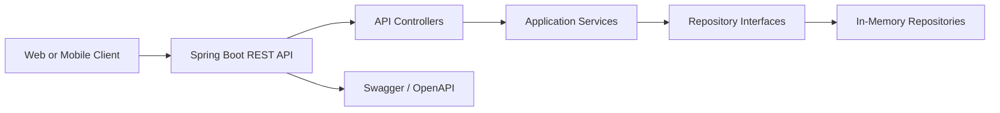

# Architecture

## Overview

The Car Wash Booking Queue System is a Spring Boot backend that exposes REST APIs for authentication, users, vehicles, services, bookings, queues, notifications, administration, and reporting. The current architecture is intentionally simple: JWT authentication, RBAC/ownership authorization, and safe API contracts are implemented, while durable persistence, tenant isolation, and production observability remain future concerns.

## Runtime View

## Layering

- **API layer**: Controllers accept HTTP requests, validate request DTOs, and return structured responses.
- **Service layer**: Application services enforce business rules for bookings, queues, notifications, service catalog operations, users, and vehicles.
- **Repository layer**: Repository interfaces isolate storage concerns from business workflows.
- **In-memory storage**: Current repository implementations support local development and automated tests without external infrastructure.
- **Configuration**: Spring configuration wires repository and service implementations for the running application.

## Domain Areas

- **Users and roles**: Customer and operational account records.
- **Vehicles**: Customer-owned vehicles that can be associated with bookings.
- **Services**: Car wash service catalog entries with price and duration information.
- **Bookings**: Scheduled service requests with lifecycle status.
- **Queue entries**: Operational queue positions and estimated wait information.
- **Notifications**: Customer communication records for booking and queue updates.

## Current Limitations

- Runtime storage is currently in-memory only; durable PostgreSQL persistence is not configured for the application.
- JWT authentication, BCrypt credential storage, Spring Security, RBAC, and ownership authorization are implemented; Marketplace tenant isolation is not, so elevated operational access is global.
- Notification records are in-app data only; no external SMS/email provider delivery is implemented.
- Daily summary reporting is basic and computed from current in-memory data.
- Multi-tenancy, payments, observability, and production SaaS hardening are future work.

## SaaS Readiness Direction

The current application is a backend foundation, not a production-ready SaaS platform. Planned architecture improvements include:

1. Durable database persistence behind existing repository interfaces.
2. Tenant-aware data boundaries for multiple car wash businesses, building on the existing authentication/RBAC foundation.
3. Security/operational audit logging and continued production security hardening.
4. Background notification delivery for email/SMS providers.
5. Observability through structured logs, metrics, traces, and health checks.
6. Deployment hardening for cloud and container platforms.

## Local Deployment

The service can be run directly with Maven or through Docker Compose. Swagger UI and the OpenAPI document are available during local development for API exploration and contract review.
