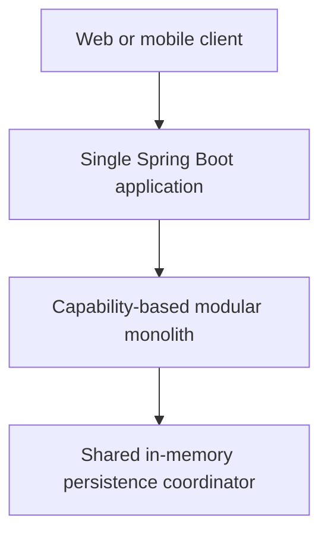
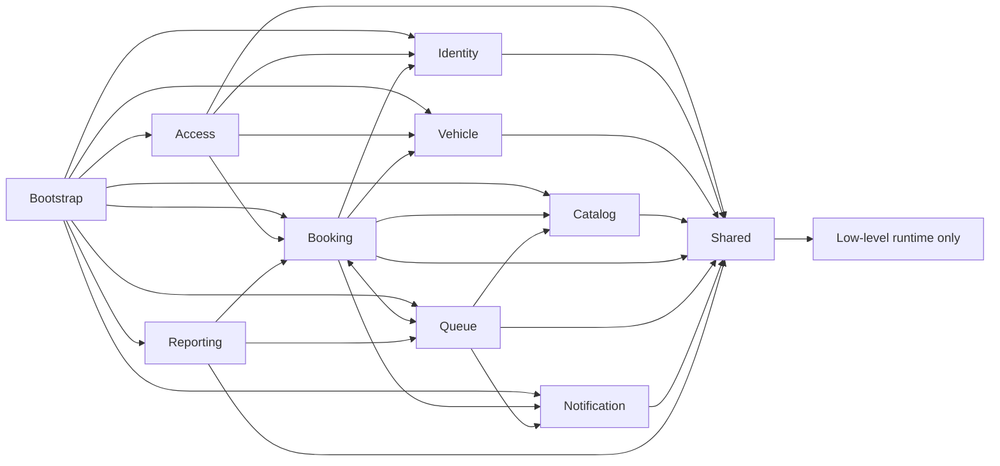

# Modular Monolith Architecture

## Deployment view

The system remains one repository, one Maven project, one Spring Boot application, one JVM, and one deployment unit. No module is independently deployed.

## Module ownership

| Module | Published/owned surface |
| --- | --- |
| `identity` | Users, roles, user lifecycle, repository contracts, and user/admin HTTP API |
| `access` | Authentication HTTP API, JWT/BCrypt infrastructure, RBAC, and resource authorization |
| `vehicle` | Vehicles, lifecycle service, repository contract/implementation, and HTTP API |
| `catalog` | Service catalogue domain, lifecycle service, repository contract/implementation, and HTTP API |
| `booking` | Bookings, scheduling and availability policies, persistence, and booking/availability HTTP APIs |
| `queue` | Queue domain, ordering/lifecycle policies, persistence, and queue HTTP API |
| `notification` | Notification records, ID generation, policy, persistence, and HTTP API |
| `reporting` | Daily summary reads and report HTTP API |
| `shared` | Standard API errors, common exceptions, generic repository primitives, runtime settings, and the single in-memory coordinator |
| `bootstrap` | Explicit Spring bean composition and runtime/OpenAPI configuration |

A module publishes its domain types and repository/application contracts only where another capability genuinely needs them. Infrastructure implementations are internal. Existing aggregate references (for example Booking to User, Vehicle, and Service) remain intentional published-domain dependencies; this refactor does not duplicate them into snapshots.

## Composition and dependencies

`bootstrap.ApplicationCompositionConfig` remains the explicit composition root. It creates repositories and services and is therefore allowed to see every module. Business modules never depend on bootstrap. Broad component scanning was not introduced.

Cross-capability workflows depend on owning-module repository or application contracts and stable domain types, never a foreign module's `infrastructure` package. Each in-memory repository implementation resides in its owning capability. `insert` remains create-only and `update` remains existing-only; no upsert-style `save` abstraction is introduced.

## Consistency and rollback

There is deliberately one `shared.infrastructure.InMemoryDataCoordinator`. Existing booking cancellation/queue rebalance and queue start/completion workflows retain a single-JVM read/write-lock boundary. Module extraction did not add nested coordinator calls. Existing state snapshots and restoration remain in the lifecycle services because repositories retain mutable canonical references.

## Enforced rules

ArchUnit runs with the normal Maven test suite and enforces:

- domain packages do not depend on API, infrastructure, or bootstrap;
- modules do not use another capability's infrastructure;
- shared does not depend on a business capability;
- business modules do not depend on bootstrap;
- REST controllers live under an owning `api` package; and
- concrete in-memory repositories live under module `infrastructure` packages.

The rules are convention-based so a future `com.carwash.marketplace` capability naturally receives the same boundaries without modifying the foundation.

## Decisions

- **Modular monolith now:** capability ownership makes the next Marketplace phase safer without changing operational topology.
- **Not microservices:** current workflows require atomic in-memory changes and have no demonstrated independent scaling/deployment need.
- **Package by capability:** related API, policy, domain, and persistence code changes together and is easier to discover.
- **ArchUnit:** package intent needs executable regression protection rather than documentation alone.
- **Global coordinator:** it preserves existing cross-aggregate atomicity in the single JVM.
- **Marketplace later:** business/branch concepts remain out of scope until these boundaries are established.
- **Spring Modulith deferred:** package conventions plus ArchUnit meet the current need without adding a second architecture framework.

## Current limitations

Persistence is in memory, elevated operational access remains global until tenant isolation, notifications are in-app only, and reporting is a basic snapshot. PostgreSQL, messaging, Marketplace concepts, and distributed transactions are intentionally absent.
