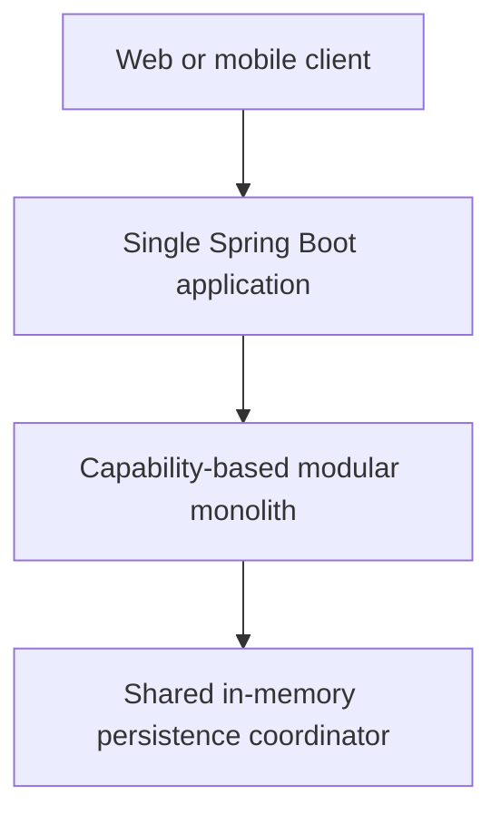
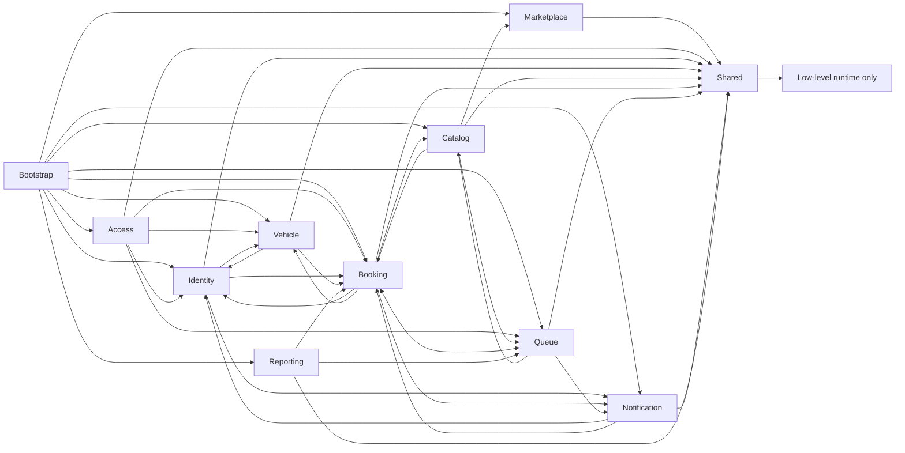

# Modular Monolith Architecture

## Deployment view

The system remains one repository, one Maven project, one Spring Boot application, one JVM, and one deployment unit. No module is independently deployed.

## Module ownership

| Module | Published/owned surface |
| --- | --- |
| `identity` | Users, roles/permissions, user lifecycle, `UserQuery`/`CredentialService`, repository contracts, and user/admin HTTP API |
| `access` | Authentication HTTP API, JWT/BCrypt infrastructure, the identity credential-contract implementation, and resource authorization |
| `vehicle` | Vehicles, lifecycle service, `VehicleQuery`, repository contract/implementation, and HTTP API |
| `catalog` | Reusable global services, branch-specific `ServiceOffering` aggregates, offering lifecycle/query contracts, module-owned repositories, and service/offering HTTP APIs |
| `booking` | Bookings, `BookingQuery`, scheduling and availability policies, persistence, and booking/availability HTTP APIs |
| `queue` | Queue domain, `QueueQuery`, ordering/lifecycle policies, persistence, and queue HTTP API |
| `notification` | Notification records, ID generation, policy, persistence, and HTTP API |
| `reporting` | Daily summary reads and report HTTP API |
| `marketplace` | Business/branch aggregates, weekly schedules, temporary closures, `MarketplaceQuery`/`BranchScheduleQuery`, lifecycle/scheduling services, module-owned repositories, bounded DTO mapping, and Marketplace HTTP APIs |
| `shared` | Standard API errors, common exceptions, generic repository primitives, runtime settings, and the single in-memory coordinator |
| `bootstrap` | Explicit Spring bean composition and runtime/OpenAPI configuration |

A module publishes its domain types and repository/application contracts only where another capability genuinely needs them. Infrastructure implementations are internal. Existing aggregate references (for example Booking to User, Vehicle, and Service) remain intentional published-domain dependencies; this refactor does not duplicate them into snapshots.

The narrow cross-module read contracts are `UserQuery`, `VehicleQuery`, `BookingQuery`, `QueueQuery`, `MarketplaceQuery`, `BranchScheduleQuery`, and `ServiceOfferingQuery`. Reporting consumes booking/queue queries; resource authorization consumes vehicle/booking/queue ownership queries; JWT validation consumes the identity query. Marketplace consumes only shared primitives and publishes detached business/branch snapshots plus an explicit-instant operational open-status decision. Catalog application code consumes only `MarketplaceQuery` and detached `BranchSnapshot` to validate and project offering state; Catalog domain code has no Marketplace dependency, Marketplace does not depend on Catalog, and no foreign repository is accessed. Identity owns the role/permission catalogue and its credential contract, while Access implements that contract with BCrypt. Workflows that must update foreign canonical aggregates still use the owning module's published repository contract under the one shared coordinator.

## Composition and dependencies

`bootstrap.ApplicationCompositionConfig` remains the explicit composition root. It creates repositories and services and is therefore allowed to see every module. Business modules never depend on bootstrap. Broad component scanning was not introduced.

Cross-capability workflows depend on owning-module repository or application contracts and stable domain types, never a foreign module's `infrastructure` package. Each in-memory repository implementation resides in its owning capability. `insert` remains create-only and `update` remains existing-only; no upsert-style `save` abstraction is introduced.

## Consistency and rollback

There is deliberately one `shared.infrastructure.InMemoryDataCoordinator`. Existing booking cancellation/queue rebalance and queue start/completion workflows retain a single-JVM write-lock boundary. Cross-module reporting and ownership queries may re-enter the same reentrant read lock; no read-to-write upgrade is performed. Write workflows do not delegate to another coordinator or introduce an independent lock. Existing package-private, module-owned state snapshots and restoration remain in the Booking and Queue lifecycle services because repositories retain mutable canonical references.

## Enforced rules

ArchUnit runs with the normal Maven test suite and enforces:

- domain packages do not depend on API, infrastructure, or bootstrap;
- modules do not use another capability's infrastructure;
- shared does not depend on a business capability;
- business modules do not depend on bootstrap;
- REST controllers live under an owning `api` package; and
- all concrete repository implementations live under shared or module `infrastructure` packages; and
- the former global technical packages remain empty.

The rules also keep Marketplace independent of Catalog, keep Catalog domain independent of Marketplace, and allow Catalog to consume only Marketplace's published application surface—not its API, domain, infrastructure, or repositories.

## Decisions

- **Modular monolith now:** capability ownership makes the next Marketplace phase safer without changing operational topology.
- **Not microservices:** current workflows require atomic in-memory changes and have no demonstrated independent scaling/deployment need.
- **Package by capability:** related API, policy, domain, and persistence code changes together and is easier to discover.
- **ArchUnit:** package intent needs executable regression protection rather than documentation alone.
- **Global coordinator:** it preserves existing cross-aggregate atomicity in the single JVM.
- **Marketplace as a module:** business and branch onboarding now extends the architecture without placing feature code in global technical packages.
- **Scheduling stays inside Marketplace:** weekly local-time recurrence, absolute temporary closures, and the open-status query are one capability; no calendar, event, or shared-module abstraction is introduced.
- **Offerings stay inside Catalog:** `ServiceOffering` owns branch/service identifiers and commercial/capacity terms; only Catalog application code looks up detached branch state through `MarketplaceQuery`.
- **Spring Modulith deferred:** package conventions plus ArchUnit meet the current need without adding a second architecture framework.

## Current limitations

Persistence is in memory, elevated Marketplace management access remains global until tenant isolation, notifications are in-app only, and reporting is a basic snapshot. Branch-scoped bookings/queues/reports, remaining-capacity calculation, branch-aware availability, PostgreSQL, messaging, and distributed transactions are intentionally absent. Weekly schedules and temporary closures are evaluated synchronously in the current branch timezone and are not external calendar integrations.
