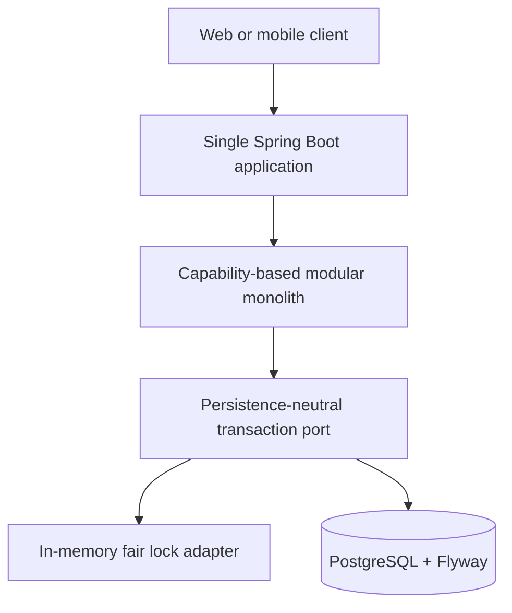
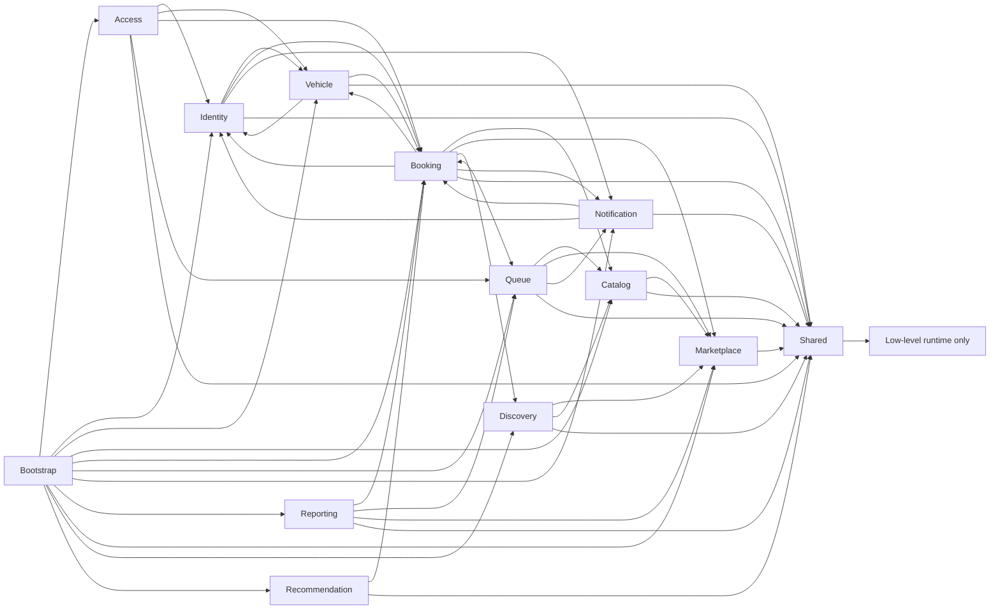
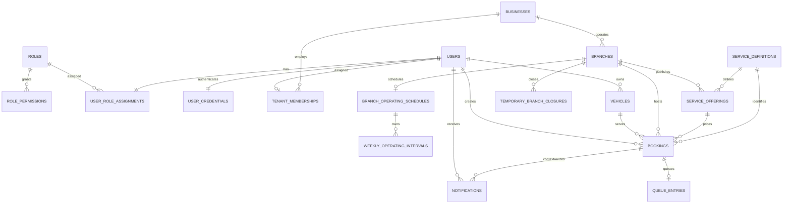

# Modular Monolith Architecture

## Deployment view

The system remains one repository, one Maven project, one Spring Boot application, one JVM, and one deployment unit. No module is independently deployed.

## Module ownership

| Module | Published/owned surface |
| --- | --- |
| `identity` | Users, roles/permissions, operational `TenantMembership`, membership lifecycle/query contracts, user lifecycle, `UserQuery`/`CredentialService`, repository contracts, and user/admin HTTP API |
| `access` | Authentication HTTP API, JWT/BCrypt infrastructure, canonical claim validation, bounded `TenantAccessContext`, the identity credential-contract implementation, and resource authorization |
| `vehicle` | Vehicles, lifecycle service, `VehicleQuery`, repository contract/implementation, and HTTP API |
| `catalog` | Reusable global services, branch-specific `ServiceOffering` aggregates, offering lifecycle/query contracts, module-owned repositories, and service/offering HTTP APIs |
| `booking` | Canonically branch/offering-scoped bookings, immutable `BookingSnapshot` queries, scheduling/availability policies, persistence, and booking/availability HTTP APIs |
| `queue` | Branch-scoped queue entries, immutable `QueueEntrySnapshot` queries, partitioned ordering/lifecycle policies, persistence, and queue HTTP API |
| `notification` | Notification records, scalar branch/offering context, bounded response DTOs, ID generation, policy, persistence, and HTTP API |
| `reporting` | Explicit branch/business daily summaries composed from published immutable queries and report HTTP API |
| `marketplace` | Business/branch aggregates, weekly schedules, temporary closures, `MarketplaceQuery`/`BranchScheduleQuery`, lifecycle/scheduling services, module-owned repositories, bounded DTO mapping, and Marketplace HTTP APIs |
| `discovery` | Nearby-search orchestration, immutable coordinate/search/result values, the `DistanceCalculator` port, Haversine adapter, and bounded discovery HTTP API |
| `recommendation` | Rule-based ranking orchestration, replaceable metric-provider ports, validated weights/radius, detached score projections, and bounded recommendation HTTP API |
| `shared` | Standard API errors, common exceptions, generic repository primitives, runtime settings, persistence-neutral transaction/lock ports, and their in-memory/PostgreSQL implementations |
| `bootstrap` | Explicit Spring bean composition and runtime/OpenAPI configuration |

A module publishes its domain types and repository/application contracts only where another capability genuinely needs them. Infrastructure implementations are internal. Existing aggregate references (for example Booking to User, Vehicle, and Service) remain intentional published-domain dependencies; this refactor does not duplicate them into snapshots.

The narrow cross-module read contracts are `UserQuery`, `VehicleQuery`, `BookingQuery`, `BranchAvailabilityQuery`, `BranchAvailabilityCandidateQuery`, `QueueQuery`, `MarketplaceQuery`, `BranchScheduleQuery`, `ServiceDefinitionQuery`, `ServiceOfferingQuery`, and `ServiceDefinitionUsageQuery`. Booking owns the shared availability policy and consumes detached Marketplace/Catalog snapshots, Queue's published estimate, and Discovery's distance-calculation port; Queue consumes Marketplace/Catalog contracts; Reporting consumes immutable booking/queue snapshots plus Marketplace scope; Discovery consumes only Marketplace/Catalog application contracts. Recommendation consumes only Booking's detached eligible-candidate query, which retains raw internal distance without changing the rounded public availability contract. Marketplace publishes instant and complete-window schedule decisions. Candidate providers never depend back on Recommendation, so no cycle is introduced.

## Composition and dependencies

`bootstrap.ApplicationCompositionConfig` remains the explicit composition root. It creates repositories and services and is therefore allowed to see every module. Business modules never depend on bootstrap. Broad component scanning was not introduced.

Cross-capability workflows depend on owning-module repository or application contracts and stable domain types, never a foreign module's `infrastructure` package. Each in-memory repository implementation resides in its owning capability. `insert` remains create-only and `update` remains existing-only; no upsert-style `save` abstraction is introduced. Tenant-specific business logic stays in Identity, Access, and the owning operational capability; `shared` contains no tenant membership or authorization policy.

Operational controllers resolve the already-validated authentication once into `TenantAccessContext`. Application services select customer subject scope, operator tenant scope, or an explicit platform-administrator path. Tenant-owned repository contracts require the relevant `businessId`, and PostgreSQL adapters carry that predicate into SQL. See [Marketplace Tenant Isolation](TENANT-ISOLATION.md) for the trust boundary and endpoint policy.

## Consistency and rollback

Application services depend on `shared.application.DataTransactionOperations`, never on a storage implementation. Tenant/subject authorization for a mutation is evaluated after its resource lock and inside the same authoritative write boundary as the mutation. The in-memory adapter retains the fair reentrant read/write lock and invokes the existing mutable-aggregate compensation. The `postgres` adapter supplies read-only reads and REQUIRED writes through Spring transactions; nested lifecycle calls participate in the same transaction. Database rollback is authoritative, so mutable in-memory compensation is skipped. Optional notifications are registered after a successful commit and run in an isolated REQUIRES_NEW transaction; mandatory lifecycle notifications remain in the parent transaction and roll it back on failure. Cross-module lifecycle notification creation uses `BookingNotificationPublisher`, which receives the already-authorized booking instead of reloading it globally.

Every persistence adapter is owned by its capability infrastructure package. Flat JPA entities, Spring Data repositories, and mappers reconstruct bounded domain objects without annotating domain aggregates or exposing proxies/lazy collections. Database foreign keys may cross capability tables, but Java modules cannot import another module's infrastructure. Hibernate Open Session in View is disabled and `ddl-auto=validate`; only immutable Flyway migrations own schema changes.

## Relational schema

Case-insensitive indexes enforce unique user email and owner/plate pairs. `tenant_memberships.user_id` permits at most one operational tenant, and deferred final-state triggers require operational roles to have one membership while forbidding memberships for customers/platform administrators. A retained offering is unique per branch/service. One schedule row owns ordered interval rows. Queue and notification rows repeat canonical operational scope only so composite foreign keys reject cross-tenant relationships; application mappers never treat repeated scalars as an alternate authority. Tenant indexes cover business/branch, offering, booking, queue, report, and notification query paths. Deletes are restrictive except for private owned records documented by the schema.

Java `LocalDateTime` values are stored as PostgreSQL `timestamp(6)` plus a `0..999` nanosecond remainder. Weekly `LocalTime` uses nano-of-day. Absolute closures use epoch-second plus nano. These mappings round-trip all supported Java nanoseconds and retain branch-local/timezone semantics.

## Transaction and locking matrix

All PostgreSQL locks are transaction-scoped advisory locks derived with `hashtextextended`. One acquisition call sorts distinct stable keys lexicographically. Workflows use the global namespace order below and never depend on a JVM-wide lock.

| Protected invariant | Transaction | Lock/guard | Key order |
|---|---|---|---|
| Booking and temporary-closure resources | REQUIRED write | `booking:{bookingId}` / `closure:{closureId}` | `00` |
| Queue-entry resource | REQUIRED write | `queue-entry:{queueEntryId}` | `01` |
| Offering overlap capacity and terms | REQUIRED write | every old/new `offering:{id}` | `02`, sorted by ID |
| Vehicle resource | REQUIRED write | `vehicle:{vehicleId}` | `03` |
| Customer booking/vehicle conflict | REQUIRED write | `customer:{userId}` | `04` |
| Queue ordering aggregate | REQUIRED write | `queue-branch:{branchId}` | `05` |
| Schedule and closure overlap | REQUIRED write | `schedule-branch:{branchId}` | `06` |
| Branch resource and lifecycle | REQUIRED write | `branch:{branchId}` | `07` |
| Business resource and lifecycle | REQUIRED write | `business:{businessId}` | `08` |
| Last active platform administrator | REQUIRED write | `platform-administrators` | `09` |

Resource identifiers are normalized before lock acquisition. Each acquisition sorts distinct keys; workflows acquire subsequent dependency keys only in increasing namespace order. Queue-entry commands first discover the immutable booking ID as an unscoped lock-key scalar (never as an authorization decision), then acquire booking plus queue-entry keys and load canonical scoped state. Branch call-next treats `queue-branch` as the selected queue aggregate lock. Rescheduling acquires both offering keys together. Catalogue term changes hold the same offering key and use Booking's detached active-overlap query to reject a duration/capacity combination below the existing peak. A deferred unique `(branch_id, active_position)` constraint permits collision-free intermediate rebalance statements and validates the final committed branch order. Guarded PostgreSQL update/delete statements carry the resource ID, authenticated business/customer predicate, and optimistic version in the actual mutation SQL; zero rows never fall back to an ID-only update. Optimistic `version` columns detect ordinary lost updates; integrity, optimistic-lock, and lock-acquisition failures are translated to the standard customer-safe contract.

## Enforced rules

ArchUnit runs with the normal Maven test suite and enforces:

- domain packages do not depend on API, infrastructure, or bootstrap;
- domain and application packages do not depend on JPA, Spring Data, or Hibernate, and JPA types remain infrastructure-owned;
- modules do not use another capability's infrastructure;
- shared does not depend on a business capability;
- business modules do not depend on bootstrap;
- REST controllers live under an owning `api` package; and
- all concrete repository implementations live under shared or module `infrastructure` packages; and
- the former global technical packages remain empty.

The rules also keep Marketplace independent of Catalog, keep Catalog domain independent of Marketplace, and allow Catalog to consume only Marketplace's published application surface—not its API, domain, infrastructure, or repositories.
OPS-001 additionally prevents Booking, Queue, and Reporting application code from accessing Marketplace/Catalog API or infrastructure packages, and prevents Catalog from depending on Booking or Queue.
GEO-001 additionally confines Discovery's cross-capability access to published Marketplace/Catalog application contracts and prevents Marketplace or Catalog from depending on Discovery.
AVAIL-002 permits Booking application code to consume Discovery's public distance port/domain coordinate and Queue's published read contract, while prohibiting Discovery, Marketplace, and Catalog from depending on Booking.
REC-001 permits Recommendation to consume only detached application contracts, prohibits access to foreign API/domain/infrastructure/repositories, and prevents Booking, Marketplace, Catalog, Queue, and Discovery from depending on Recommendation.

## Decisions

- **Modular monolith now:** capability ownership makes the next Marketplace phase safer without changing operational topology.
- **Not microservices:** current workflows require atomic cross-aggregate transactions and have no demonstrated independent scaling/deployment need.
- **Package by capability:** related API, policy, domain, and persistence code changes together and is easier to discover.
- **ArchUnit:** package intent needs executable regression protection rather than documentation alone.
- **Selectable persistence:** the lightweight adapter preserves single-JVM behavior; the `postgres` adapter supplies durable transactions and database-visible invariant locks without copying application services.
- **Marketplace as a module:** business and branch onboarding now extends the architecture without placing feature code in global technical packages.
- **Scheduling stays inside Marketplace:** weekly local-time recurrence, absolute temporary closures, and the open-status query are one capability; no calendar, event, or shared-module abstraction is introduced.
- **Offerings stay inside Catalog:** `ServiceOffering` owns branch/service identifiers and commercial/capacity terms; only Catalog application code looks up detached branch state through `MarketplaceQuery`.
- **Operational scope is canonical:** Booking stores immutable `branchId` and controlled `serviceOfferingId`; Queue inherits both from the canonical booking and partitions every ordering decision by branch.
- **Reporting scope is explicit:** one `branchId` or `businessId` is required; tenant authorization remains deliberately separate.
- **Distance is replaceable:** Discovery owns a narrow `DistanceCalculator` application port; the current infrastructure adapter uses the IUGG mean Earth radius (`6371.0088 km`) and no external network service.
- **Availability is one decision:** Booking owns a detached `BranchAvailabilityQuery`; search and coordinated booking writes share lifecycle, branch-timezone offset uniqueness, continuous-window-anchored slot alignment, complete-window, and offering-capacity rules while customer/vehicle conflicts remain command-specific. An offset-aware search instant whose branch-local start is ambiguous is rejected internally so it cannot advertise a value the current local-date-time booking contract cannot identify. Marketplace publishes the immutable applicable window anchor without exposing its repositories or schedule aggregates.
- **Recommendation ranks; Booking decides:** Booking publishes detached eligible candidates from the exact AVAIL-002 search path, including raw distance for internal ranking. Recommendation owns no repositories or eligibility rules, and its point-in-time results do not reserve capacity; booking creation revalidates authoritatively.
- **Spring Modulith deferred:** package conventions plus ArchUnit meet the current need without adding a second architecture framework.

## Current limitations

The default lightweight profile remains in memory; durability requires `postgres`. Elevated operational/Marketplace access is tenant-scoped, notifications remain in-app only, and reporting remains a basic tenant-scoped snapshot. Nearby distance is straight-line rather than driving distance and has no traffic, route, geocoding, external maps, cache, or geospatial index. Availability is a non-reserving snapshot; audit logging, concurrent bay/staff allocation, managed database provisioning, backups, replicas, messaging, and distributed transactions remain intentionally absent.
