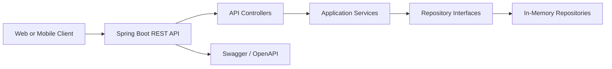

# Architecture

## Overview

The Car Wash Booking Queue System is a Spring Boot backend that exposes REST APIs for customer, vehicle, service catalog, booking, queue, and notification workflows. The current architecture is intentionally simple so the product can validate core workflows before adding production concerns such as durable persistence, authentication, tenant isolation, and observability.

## Runtime View

## Layering

- **API layer**: Controllers accept HTTP requests, validate request DTOs, and return structured responses.
- **Service layer**: Application services enforce business rules for bookings, queues, notifications, service catalog operations, users, and vehicles.
- **Repository layer**: Repository interfaces isolate storage concerns from business workflows.
- **In-memory storage**: Current repository implementations support local development and automated tests without external infrastructure.
- **Configuration**: Spring configuration wires repository and service implementations for the running application.

## Domain Areas

- **Users and roles**: Customer and operational account records.
- **Vehicles**: Customer-owned vehicles that can be associated with bookings.
- **Services**: Car wash service catalog entries with price and duration information.
- **Bookings**: Scheduled service requests with lifecycle status.
- **Queue entries**: Operational queue positions and estimated wait information.
- **Notifications**: Customer communication records for booking and queue updates.

## SaaS Readiness Direction

The current application is a backend foundation. Planned architecture improvements include:

1. Durable database persistence behind existing repository interfaces.
2. Secure authentication and password handling.
3. Role-based authorization for customers, staff, and business owners.
4. Tenant-aware data boundaries for multiple car wash businesses.
5. Background notification delivery for email/SMS providers.
6. Observability through structured logs, metrics, traces, and health checks.
7. Deployment hardening for cloud and container platforms.

## Local Deployment

The service can be run directly with Maven or through Docker Compose. Swagger UI and the OpenAPI document are available during local development for API exploration and contract review.
