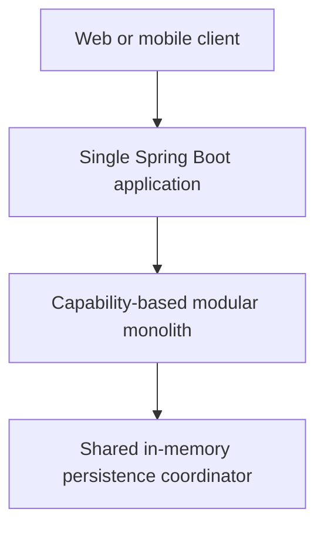
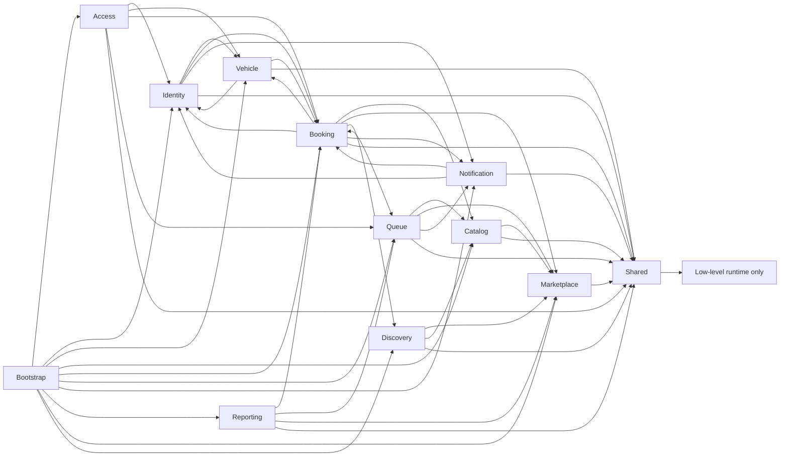

# Modular Monolith Architecture

## Deployment view

The system remains one repository, one Maven project, one Spring Boot application, one JVM, and one deployment unit. No module is independently deployed.

## Module ownership

| Module | Published/owned surface |
| --- | --- |
| `identity` | Users, roles/permissions, user lifecycle, `UserQuery`/`CredentialService`, repository contracts, and user/admin HTTP API |
| `access` | Authentication HTTP API, JWT/BCrypt infrastructure, the identity credential-contract implementation, and resource authorization |
| `vehicle` | Vehicles, lifecycle service, `VehicleQuery`, repository contract/implementation, and HTTP API |
| `catalog` | Reusable global services, branch-specific `ServiceOffering` aggregates, offering lifecycle/query contracts, module-owned repositories, and service/offering HTTP APIs |
| `booking` | Canonically branch/offering-scoped bookings, immutable `BookingSnapshot` queries, scheduling/availability policies, persistence, and booking/availability HTTP APIs |
| `queue` | Branch-scoped queue entries, immutable `QueueEntrySnapshot` queries, partitioned ordering/lifecycle policies, persistence, and queue HTTP API |
| `notification` | Notification records, scalar branch/offering context, bounded response DTOs, ID generation, policy, persistence, and HTTP API |
| `reporting` | Explicit branch/business daily summaries composed from published immutable queries and report HTTP API |
| `marketplace` | Business/branch aggregates, weekly schedules, temporary closures, `MarketplaceQuery`/`BranchScheduleQuery`, lifecycle/scheduling services, module-owned repositories, bounded DTO mapping, and Marketplace HTTP APIs |
| `discovery` | Nearby-search orchestration, immutable coordinate/search/result values, the `DistanceCalculator` port, Haversine adapter, and bounded discovery HTTP API |
| `shared` | Standard API errors, common exceptions, generic repository primitives, runtime settings, and the single in-memory coordinator |
| `bootstrap` | Explicit Spring bean composition and runtime/OpenAPI configuration |

A module publishes its domain types and repository/application contracts only where another capability genuinely needs them. Infrastructure implementations are internal. Existing aggregate references (for example Booking to User, Vehicle, and Service) remain intentional published-domain dependencies; this refactor does not duplicate them into snapshots.

The narrow cross-module read contracts are `UserQuery`, `VehicleQuery`, `BookingQuery`, `BranchAvailabilityQuery`, `QueueQuery`, `MarketplaceQuery`, `BranchScheduleQuery`, `ServiceDefinitionQuery`, `ServiceOfferingQuery`, and `ServiceDefinitionUsageQuery`. Booking owns the shared availability policy and consumes detached Marketplace/Catalog snapshots, Queue's published estimate, and Discovery's distance-calculation port; Queue consumes Marketplace/Catalog contracts; Reporting consumes immutable booking/queue snapshots plus Marketplace scope; Discovery consumes only Marketplace/Catalog application contracts. Marketplace publishes instant and complete-window schedule decisions. Catalog's reference-check port remains implemented in bootstrap, and neither Marketplace nor Catalog depends on Booking or Discovery, so no cycle is introduced.

## Composition and dependencies

`bootstrap.ApplicationCompositionConfig` remains the explicit composition root. It creates repositories and services and is therefore allowed to see every module. Business modules never depend on bootstrap. Broad component scanning was not introduced.

Cross-capability workflows depend on owning-module repository or application contracts and stable domain types, never a foreign module's `infrastructure` package. Each in-memory repository implementation resides in its owning capability. `insert` remains create-only and `update` remains existing-only; no upsert-style `save` abstraction is introduced.

## Consistency and rollback

There is deliberately one `shared.infrastructure.InMemoryDataCoordinator`. Booking creation resolves branch/offering/service state atomically, and booking cancellation/branch rebalance plus queue start/completion retain a single-JVM write-lock boundary. Cross-module Marketplace/Catalog/reporting/ownership queries may re-enter the same reentrant lock; no read-to-write upgrade is performed. Write workflows do not delegate to another coordinator or introduce an independent lock. Existing package-private state snapshots and restoration remain in Booking and Queue because repositories retain mutable canonical references.

## Enforced rules

ArchUnit runs with the normal Maven test suite and enforces:

- domain packages do not depend on API, infrastructure, or bootstrap;
- modules do not use another capability's infrastructure;
- shared does not depend on a business capability;
- business modules do not depend on bootstrap;
- REST controllers live under an owning `api` package; and
- all concrete repository implementations live under shared or module `infrastructure` packages; and
- the former global technical packages remain empty.

The rules also keep Marketplace independent of Catalog, keep Catalog domain independent of Marketplace, and allow Catalog to consume only Marketplace's published application surface—not its API, domain, infrastructure, or repositories.
OPS-001 additionally prevents Booking, Queue, and Reporting application code from accessing Marketplace/Catalog API or infrastructure packages, and prevents Catalog from depending on Booking or Queue.
GEO-001 additionally confines Discovery's cross-capability access to published Marketplace/Catalog application contracts and prevents Marketplace or Catalog from depending on Discovery.
AVAIL-002 permits Booking application code to consume Discovery's public distance port/domain coordinate and Queue's published read contract, while prohibiting Discovery, Marketplace, and Catalog from depending on Booking.

## Decisions

- **Modular monolith now:** capability ownership makes the next Marketplace phase safer without changing operational topology.
- **Not microservices:** current workflows require atomic in-memory changes and have no demonstrated independent scaling/deployment need.
- **Package by capability:** related API, policy, domain, and persistence code changes together and is easier to discover.
- **ArchUnit:** package intent needs executable regression protection rather than documentation alone.
- **Global coordinator:** it preserves existing cross-aggregate atomicity in the single JVM.
- **Marketplace as a module:** business and branch onboarding now extends the architecture without placing feature code in global technical packages.
- **Scheduling stays inside Marketplace:** weekly local-time recurrence, absolute temporary closures, and the open-status query are one capability; no calendar, event, or shared-module abstraction is introduced.
- **Offerings stay inside Catalog:** `ServiceOffering` owns branch/service identifiers and commercial/capacity terms; only Catalog application code looks up detached branch state through `MarketplaceQuery`.
- **Operational scope is canonical:** Booking stores immutable `branchId` and controlled `serviceOfferingId`; Queue inherits both from the canonical booking and partitions every ordering decision by branch.
- **Reporting scope is explicit:** one `branchId` or `businessId` is required; tenant authorization remains deliberately separate.
- **Distance is replaceable:** Discovery owns a narrow `DistanceCalculator` application port; the current infrastructure adapter uses the IUGG mean Earth radius (`6371.0088 km`) and no external network service.
- **Availability is one decision:** Booking owns a detached `BranchAvailabilityQuery`; search and coordinated booking writes share lifecycle, continuous-window-anchored slot alignment, complete-window, and offering-capacity rules while customer/vehicle conflicts remain command-specific. Marketplace publishes the immutable applicable window anchor without exposing its repositories or schedule aggregates.
- **Spring Modulith deferred:** package conventions plus ArchUnit meet the current need without adding a second architecture framework.

## Current limitations

Persistence is in memory, elevated operational/Marketplace access remains global until tenant isolation, notifications are in-app only, and reporting remains a basic scoped snapshot. Nearby distance is straight-line rather than driving distance and has no traffic, route, geocoding, external maps, cache, or geospatial index. Availability is a non-reserving snapshot; concurrent bay/staff allocation, PostgreSQL, messaging, and distributed transactions remain intentionally absent.
