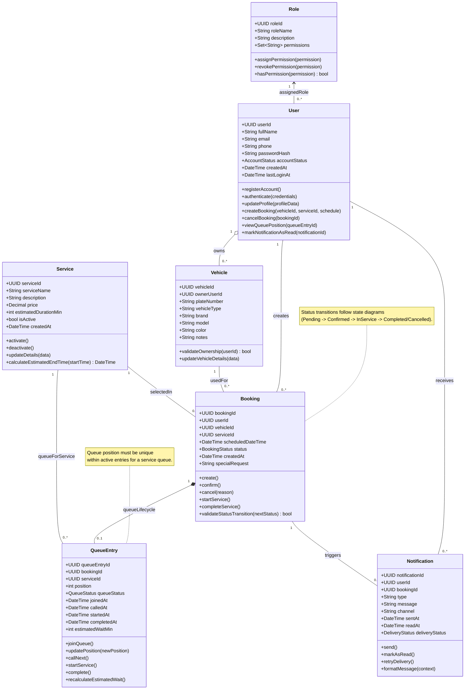

# Class Diagram

## 1. Overview

This class diagram translates the current domain model into an object-oriented design view for implementation. It defines the core classes, their attributes and responsibilities, and the relationships that support user management, booking, queue flow, and notifications in the MVP.

## 2. Mermaid Class Diagram

## 3. Key Design Decisions

- **Class selection:** The model keeps exactly the seven MVP classes already established in the domain model (`User`, `Role`, `Vehicle`, `Service`, `Booking`, `QueueEntry`, `Notification`) to maintain consistency and avoid scope creep.
- **Relationship choices:**
  - `User` to `Role` is an association (many users can share one role).
  - `User` to `Vehicle` uses **aggregation** because a user owns vehicles, but vehicle records can still be managed independently.
  - `Booking` to `QueueEntry` uses **composition** because a queue entry exists only as part of a booking’s queue lifecycle.
  - Remaining links are associations for operational interactions.
- **Multiplicity decisions:** Multiplicities reflect expected MVP behavior (e.g., one user can create many bookings, one booking can have zero or one queue entry, one service can appear in many bookings/queue entries).
- **Inheritance choice:** No inheritance was used for Customer/Admin/Staff; role-based access is modeled via `User` + `Role` as recommended, keeping the model simpler and more maintainable.

## 4. Alignment with Prior Work

- **Functional Requirements:** Supports FR-01 to FR-07 through authentication (`User`/`Role`), service catalog (`Service`), booking and queue operations (`Booking`/`QueueEntry`), notifications (`Notification`), and admin operations through role permissions.
- **Use Cases:** Directly maps to register/authenticate, browse services, create booking, join/view queue, and manage bookings/services.
- **Behavioral Models:** Booking and queue status methods/notes align with previously defined state and activity workflows.
