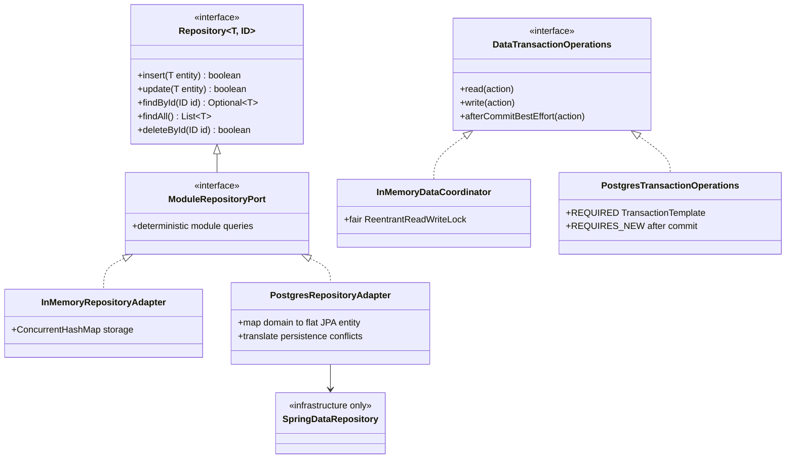

# Repository Class Diagram

Every domain repository port stays persistence-agnostic. Each capability infrastructure package owns both its in-memory adapter and flat JPA entities/Spring Data repository/PostgreSQL adapter. Application services select adapters by profile through the composition root and never receive JPA entities, proxies, or foreign infrastructure repositories. `insert` is create-only, `update` is update-only, and reads preserve explicit deterministic ordering. The obsolete database-user stub and storage factory are removed.
