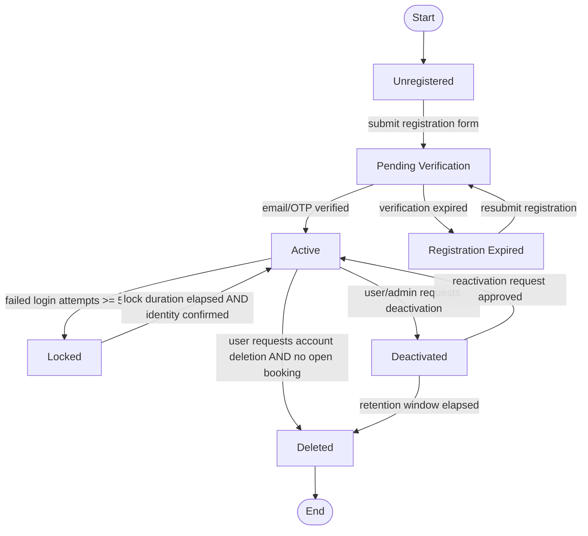
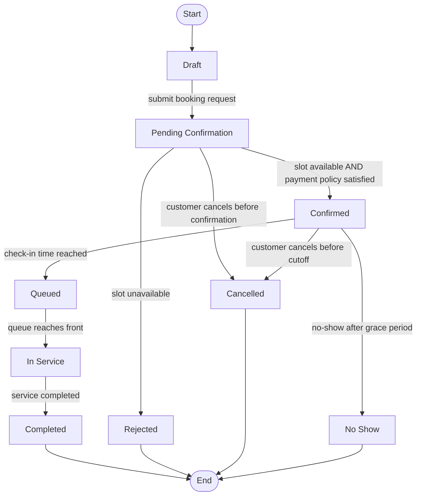
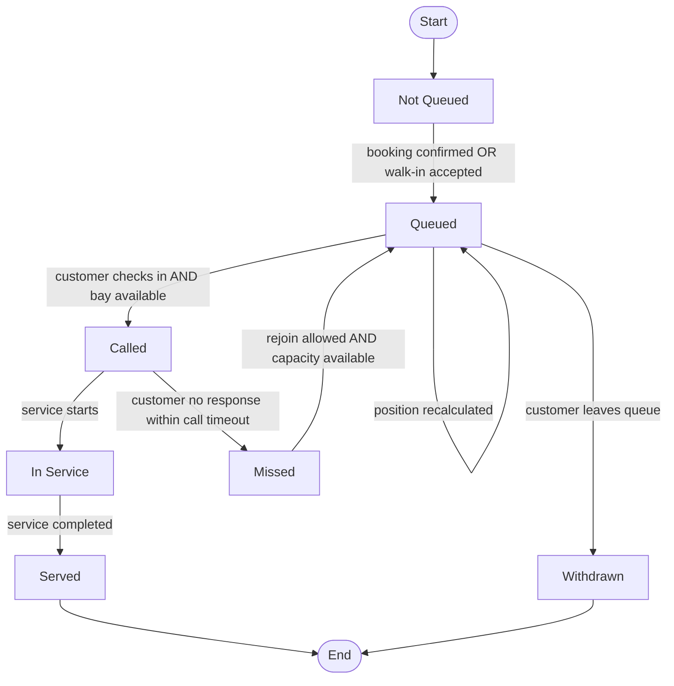
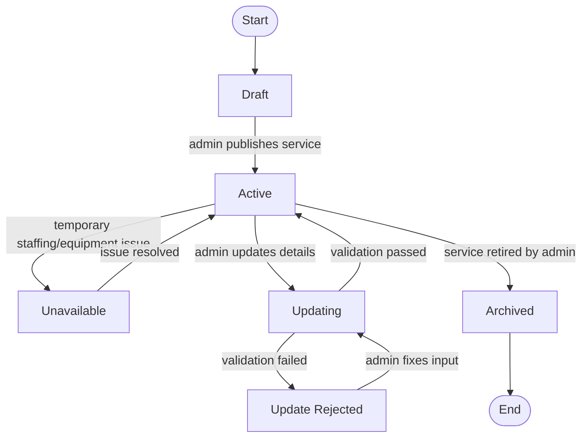
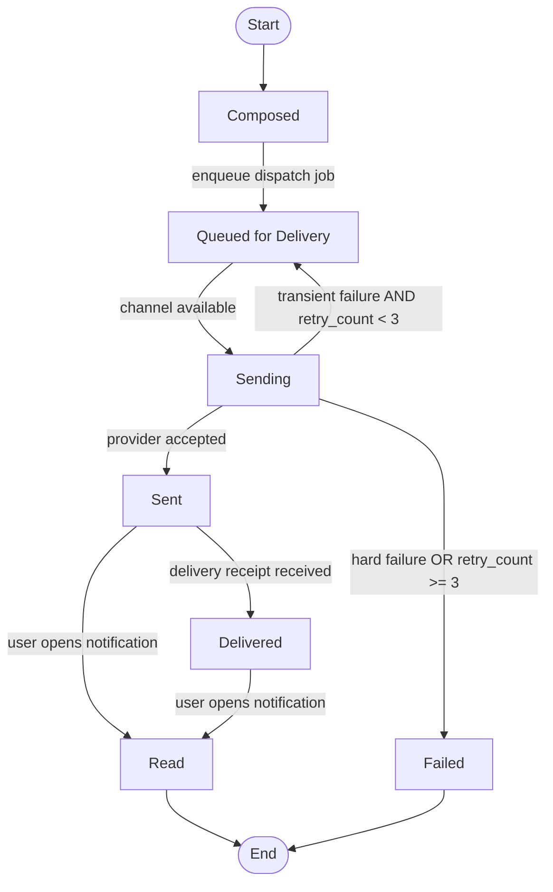
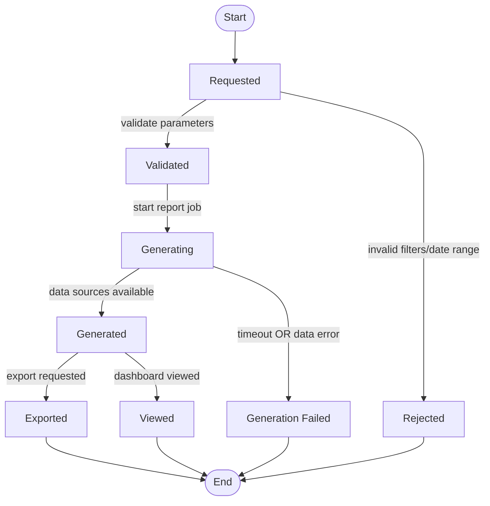
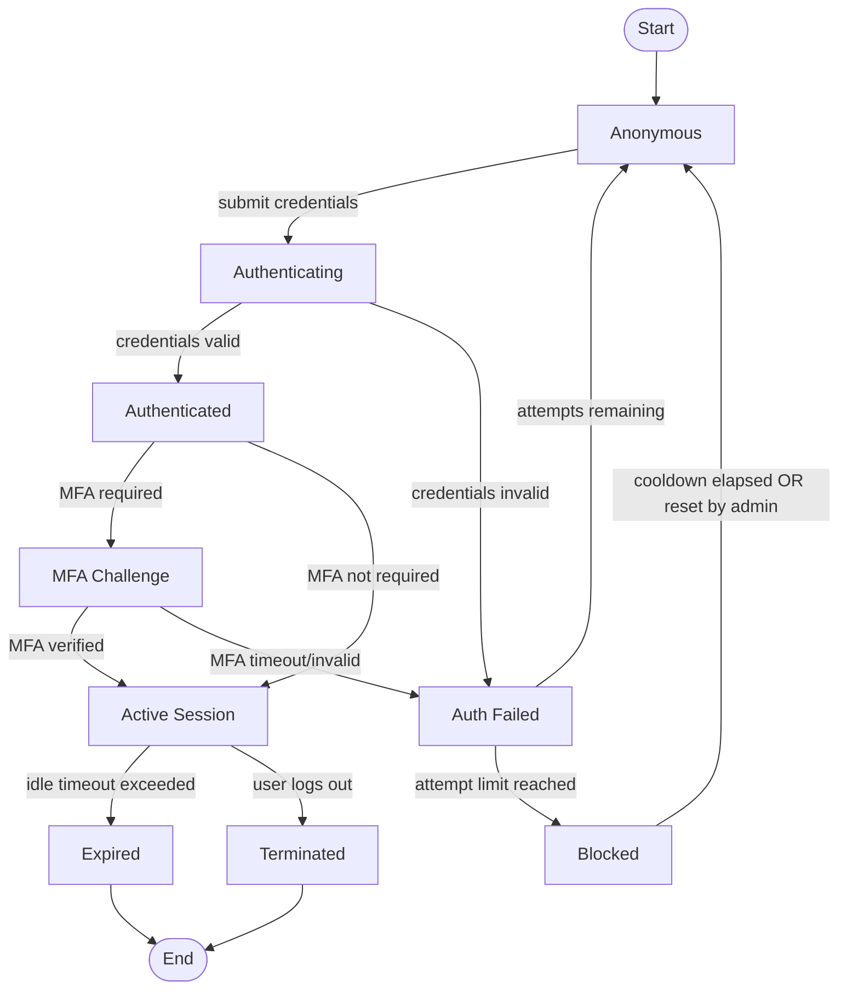
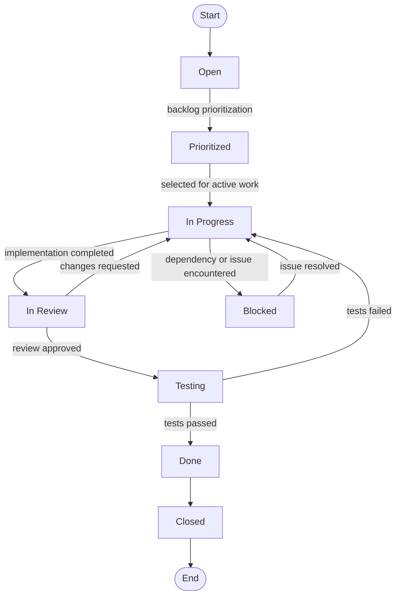

# Object State Modeling

## 1. Overview

Object state modeling describes how a system object changes over time in response to events, business rules, and user/system actions. Instead of only listing features, state models show *behavioral lifecycle*: where an object starts, what triggers movement between states, what guard conditions must be satisfied, and where the lifecycle ends.

For this web-based car wash booking and queue management MVP, state modeling clarifies expected runtime behavior for account access, booking progression, queue handling, service availability, notification delivery, report generation, authentication control, and engineering workflow execution through GitHub issues.

## 2. User Account State Diagram

### Explanation

- **Key states**: `Unregistered`, `Pending Verification`, `Active`, `Locked`, `Deactivated`, and terminal `Deleted` represent the lifecycle of a customer/admin identity in the platform.
- **Key transitions**: registration submission moves to pending verification; successful verification enables active use; repeated failed logins trigger temporary lock; deactivation and deletion support account lifecycle management.
- **Relevant guards**:
  - `failed login attempts >= 5` before locking.
  - `identity confirmed` before unlock/recovery.
  - `no open booking` before permanent deletion to preserve booking consistency.
- **Traceability**:
  - Aligns strongly with **FR-01 User Registration and Authentication**.
  - Supports the product use cases use cases **Register Account** and **Authenticate User**.
  - Matches the product backlog delivery cycle/user story focus on onboarding and secure sign-in as MVP priorities.

## 3. Booking State Diagram

### Explanation

- **Key states**: `Draft` through `Completed` captures complete booking flow, including negative outcomes (`Rejected`, `Cancelled`, `No Show`).
- **Key transitions**: a request is evaluated in `Pending Confirmation`; confirmed bookings transition to queue and then execution; operational exceptions are explicitly handled.
- **Relevant guards**:
  - `slot available AND payment policy satisfied` to confirm.
  - `customer cancels before cutoff` to prevent late cancellation abuse.
  - `no-show after grace period` to protect queue integrity.
- **Traceability**:
  - Directly maps to **FR-03 Booking System** and integrates with **FR-04 Queue Management**.
  - Aligns with use cases **Create Booking**, **Join Virtual Queue**, **View Queue Position**, and **Manage Bookings and Queue**.
  - Reflects the product backlog delivery cycle scope around booking + queue MVP execution.

## 4. Queue Entry State Diagram

### Explanation

- **Key states**: from `Queued` to `Called` and `In Service`, with exception states `Withdrawn` and `Missed`.
- **Key transitions**: entry creation, position updates, call-forward mechanics, timeout handling, and service completion.
- **Relevant guards**:
  - `bay available` before calling next entry.
  - `call timeout` before moving to `Missed`.
  - `rejoin allowed` under queue policy constraints.
- **Traceability**:
  - Core to **FR-04 Queue Management**.
  - Supports use cases **Join Virtual Queue**, **View Queue Position**, and **Manage Bookings and Queue**.
  - Fits the product backlog delivery cycle items involving live queue visibility and queue progression rules.

## 5. Service State Diagram

### Explanation

- **Key states**: `Draft`, `Active`, `Unavailable`, `Updating`, and `Archived` describe catalog management lifecycle.
- **Key transitions**: publish, temporary suspension, metadata/pricing updates, and retirement.
- **Relevant guards**:
  - `validation passed` for safe catalog updates.
  - operational constraints (staff/equipment) governing availability.
- **Traceability**:
  - Maps to **FR-02 Service Catalog** and admin operations in **FR-06 Administrative Dashboard**.
  - Supports use cases **Browse Service Catalog** and **Manage Services**.
  - Connects with the product backlog backlog items for service management and pricing visibility.

## 6. Notification State Diagram

### Explanation

- **Key states**: from composition through queueing/sending to delivered/read or failed.
- **Key transitions**: retries are modeled explicitly to handle communication reliability.
- **Relevant guards**:
  - `retry_count < 3` for bounded resend logic.
  - channel/provider availability before sending.
- **Traceability**:
  - Implements **FR-05 Notifications** behavior.
  - Reinforces booking/queue use cases by surfacing status changes to users.
  - Matches agile concerns on user communication and operational transparency from the product backlog.

## 7. Report State Diagram

### Explanation

- **Key states**: request validation, asynchronous generation, and consumption paths (`Viewed` / `Exported`).
- **Key transitions**: parameter checks prevent invalid workloads; generation handles both success and fault outcomes.
- **Relevant guards**:
  - `invalid filters/date range` blocking report creation.
  - `data sources available` requirement for successful generation.
- **Traceability**:
  - Corresponds to **FR-07 Basic Reporting** and admin access in **FR-06**.
  - Supports operational management use case **Manage Bookings and Queue** through analytics/visibility.
  - Aligns with the product backlog planning where reporting is typically secondary but still part of MVP completeness.

## 8. Authentication Session State Diagram

### Explanation

- **Key states**: distinguishes identity proof (`Authenticating`) from runtime authorization (`Active Session`), with explicit failure and blocking controls.
- **Key transitions**: supports optional MFA path and session termination via logout/timeout.
- **Relevant guards**:
  - `attempt limit reached` to trigger block.
  - `MFA required` based on policy/risk profile.
  - `idle timeout exceeded` for secure expiration.
- **Traceability**:
  - Strongly supports **FR-01 User Registration and Authentication**.
  - Maps to use case **Authenticate User**.
  - Mirrors the product backlog stories around secure login and session security for MVP readiness.

## 9. GitHub Issue / Work Item State Diagram

### Explanation

- **Key states**: `Open`, `Prioritized`, `In Progress`, `In Review`, `Testing`, `Done`, and `Closed` reflect the lifecycle of a work item in the delivery workflow.
- **Key transitions**: issues move from backlog into implementation, then through review and testing before closure.
- **Relevant guards**:
  - `review approved` before entering testing.
  - `tests passed` before being marked done.
  - blocked work can only resume once dependencies or issues are resolved.
- **Traceability**:
  - Supports the product backlog backlog and delivery planning artefacts.
  - Directly aligns with the product delivery workflow.
  - Reinforces implementation readiness for functional requirements and user stories.
